[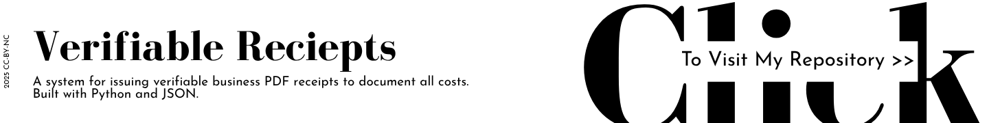]()

[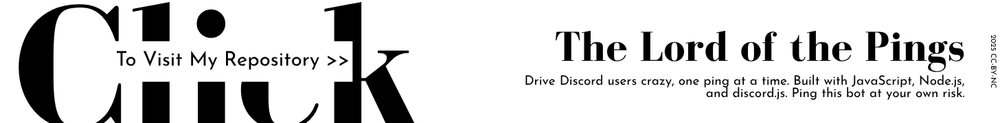](https://github.com/Nour-MK/The-Lord-of-the-Pings)

[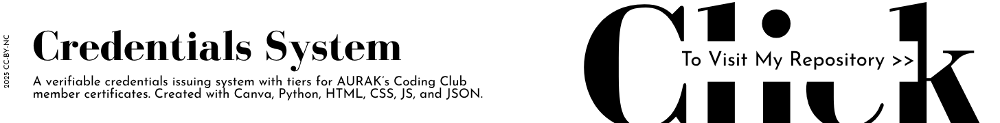](https://github.com/AURAK-Coding-Club/Club-Credentials)

[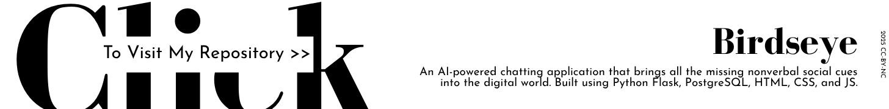]()

[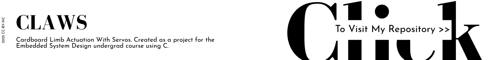](https://github.com/MONO-1223/AURAK-CENG431-CLAWS)

[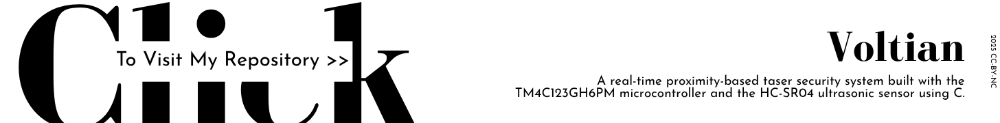](https://github.com/MONO-1223/AURAK-CENG432-Voltian)

[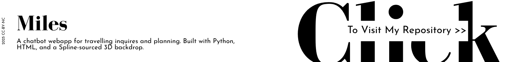](https://github.com/Nour-MK/AURAK-CSCI-499-Miles)

[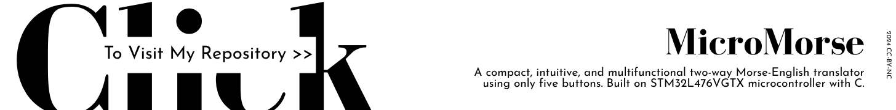](https://github.com/MONO-1223/AURAK-CENG315-MicroMorse)

[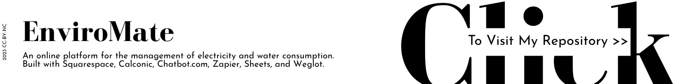]()

[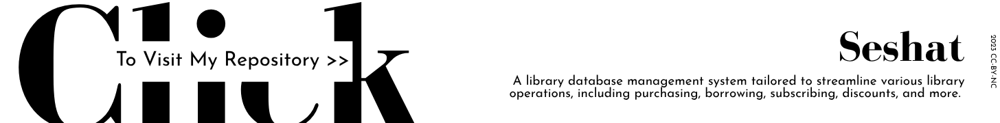]()

[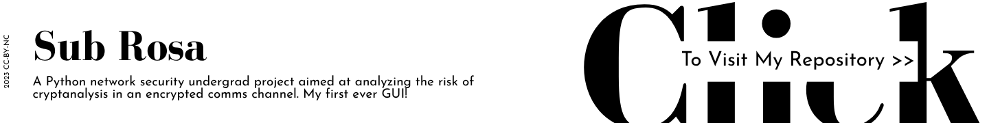]()
